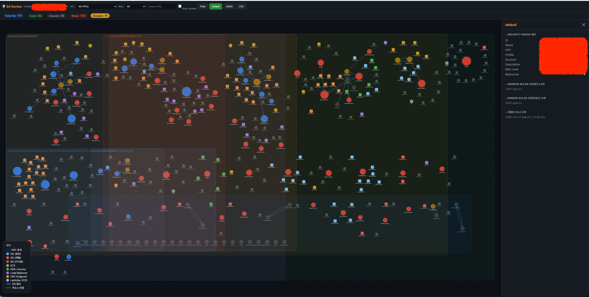

# AWS Security Group Review Dashboard

A visualization dashboard for AWS Security Group review, designed for ISMS compliance audits.

Identify unused SGs, overly permissive rules, and circular references at a glance to establish the principle of least privilege.


[한국어](README.md) | **English**

## Key Features

- **23 AWS resource type collection** — EC2, RDS, Aurora, ALB/NLB, Lambda, ECS, EKS, ElastiCache, Redshift, OpenSearch, DocumentDB, MSK, EMR, SageMaker, MWAA, DMS, EFS, DAX, Neptune, MemoryDB, and more
- **Security analysis** — Unused SGs, risky rules (critical/high/medium), circular references, redundant rules, default SG rule review
- **Graph visualization** — Cytoscape.js network graph with VPC boundary grouping
- **Table view** — Sortable SG list table (graph/table toggle)
- **Multi-account** — Auto-detect profiles from `~/.aws/config`, deduplicate same accounts
- **Filtering** — Profile, VPC, Risk Level, search, hide unused
- **Governance checks** — Tag-based ISMS governance (owner, review date, expiry, justification, etc.)
- **Export** — Download unused SG list as JSON/CSV

## Screenshot

### Graph View

Visualizes SGs as nodes with resource connections and SG-to-SG references as edges.
- Node color: Normal (blue), Risky (red), Warning (yellow), Unused (gray)
- VPC groups separated by dashed boundaries



---

## Quick Start

### Prerequisites

- AWS CLI profile configured (`~/.aws/config` or `~/.aws/credentials`)
- Required IAM permissions: [see below](#required-iam-permissions)

### Run

```bash
git clone https://github.com/yeoli9/security-group-review-dashboard.git
cd security-group-review-dashboard

./run.sh
```

Use arrow keys to select from the interactive menu.

```
  AWS Security Group Review Dashboard
  ────────────────────────────────────────

   > Local Setup + Run   Python venv setup + start server
     Local Run            Start server with existing venv
     Docker Compose       Build + run with Docker
     Docker Compose Down  Stop Docker containers
     Clean                Remove venv, cache, etc.

  ↑↓ Select  Enter Run  q Quit
```

Open http://localhost:5000 and click **Collect** to start gathering data.

---

## Workflow

1. Click **Collect** → Select AWS profiles → Start collection
2. Review SG status in graph or table view
3. Filter by VPC, risk level, or search keyword
4. Click an SG node or table row → View rules, resources, and risks in the detail panel
5. Export unused SGs as JSON/CSV

## Governance Tag Configuration

Checks governance compliance based on AWS tags attached to Security Groups, designed for ISMS audits.

Edit `config.json` to configure tag names and rules. (Also editable via `./run.sh` → Configure)

```json
{
  "governance_tags": {
    "owner": "Owner",
    "project": "Project",
    "environment": "Environment",
    "reviewed_at": "ReviewedAt",
    "expires_at": "ExpiresAt",
    "justification": "Justification",
    "risk_accepted": "RiskAccepted",
    "approved_by": "ApprovedBy"
  },
  "governance_rules": {
    "required_tags": ["owner", "justification"],
    "review_interval_days": 90,
    "warn_expiry_days_before": 14
  }
}
```

| Key | Default Tag | Description |
|-----|------------|-------------|
| `owner` | `Owner` | Owner / team |
| `project` | `Project` | Project or service name |
| `environment` | `Environment` | prod / staging / dev |
| `reviewed_at` | `ReviewedAt` | Last review date (YYYY-MM-DD) |
| `expires_at` | `ExpiresAt` | Expiration date (YYYY-MM-DD) |
| `justification` | `Justification` | Reason for the SG |
| `risk_accepted` | `RiskAccepted` | Risk acceptance flag |
| `approved_by` | `ApprovedBy` | Approver |

Override tag names with environment variables:

```bash
SG_TAG_OWNER=ResourceOwner SG_TAG_REVIEWED_AT=LastAuditDate python server.py
```

### Checks Performed

- **Missing required tags** — warns if tags in `required_tags` are absent from an SG
- **Overdue review** — warns if `ReviewedAt` exceeds `review_interval_days`
- **Expired / expiring soon** — warns if `ExpiresAt` is past or within `warn_expiry_days_before`

## Required IAM Permissions

Only read-only permissions are used. (No write APIs)

```json
{
    "Effect": "Allow",
    "Action": [
        "ec2:DescribeSecurityGroups",
        "ec2:DescribeInstances",
        "ec2:DescribeNetworkInterfaces",
        "ec2:DescribeVpcs",
        "ec2:DescribeVpcEndpoints",
        "rds:DescribeDBInstances",
        "rds:DescribeDBClusters",
        "elasticloadbalancing:DescribeLoadBalancers",
        "lambda:ListFunctions",
        "lambda:GetFunction",
        "ecs:ListClusters",
        "ecs:ListServices",
        "ecs:DescribeServices",
        "eks:ListClusters",
        "eks:DescribeCluster",
        "elasticache:DescribeCacheClusters",
        "redshift:DescribeClusters",
        "es:DescribeDomains",
        "es:ListDomainNames",
        "kafka:ListClustersV2",
        "elasticmapreduce:ListClusters",
        "elasticmapreduce:DescribeCluster",
        "sagemaker:ListNotebookInstances",
        "sagemaker:DescribeNotebookInstance",
        "airflow:ListEnvironments",
        "airflow:GetEnvironment",
        "dms:DescribeReplicationInstances",
        "elasticfilesystem:DescribeMountTargets",
        "elasticfilesystem:DescribeMountTargetSecurityGroups",
        "elasticfilesystem:DescribeFileSystems",
        "dax:DescribeClusters",
        "neptune:DescribeDBClusters",
        "memorydb:DescribeClusters",
        "sts:GetCallerIdentity"
    ],
    "Resource": "*"
}
```

## Project Structure

```
├── app/
│   ├── server.py         # Flask API server
│   ├── collector.py      # AWS data collection (23 resource types)
│   ├── analyzer.py       # SG analysis (unused, risky rules, circular refs, governance)
│   ├── governance.py     # Governance tag config loader
│   └── static/
│       └── index.html    # Dashboard frontend (Cytoscape.js)
├── config.json           # Governance tag/rule settings
├── requirements.txt      # Python dependencies
├── run.sh                # Interactive launch script
├── Dockerfile            # Docker image build
├── docker-compose.yml    # Docker Compose config
└── docs/
    ├── PLAN.md           # Project spec
    └── PROGRESS.md       # Progress log
```

## API Endpoints

| Method | Path | Description |
|--------|------|-------------|
| GET | `/api/profiles` | List AWS profiles |
| POST | `/api/collect` | Start data collection |
| GET | `/api/accounts` | List collected accounts |
| GET | `/api/data` | Collected data |
| GET | `/api/findings` | Analysis results |
| GET | `/api/graph` | Graph visualization data |
| GET | `/api/sg/{id}` | SG detail |
| GET | `/api/export/unused` | Export unused SGs (JSON/CSV) |

## Contributing

Contributions are welcome! Feel free to open an Issue or submit a Pull Request.

1. Fork and create a branch (`git checkout -b feature/my-feature`)
2. Commit your changes (`git commit -m 'Add my feature'`)
3. Push the branch (`git push origin feature/my-feature`)
4. Open a Pull Request

## License

[MIT License](LICENSE)
